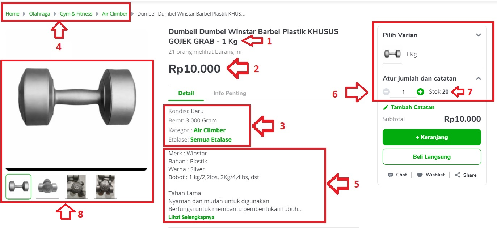
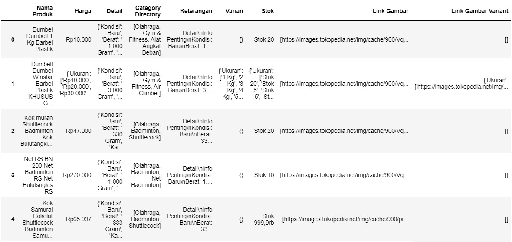

# Tokopedia Scraping
[INTENDED FOR INDONESIAN AUDIENCE]

This is the code used to scrape data from a certain shop in an Indonesian marketplace, Tokopedia.

The data that I took were:
1. Product Name
2. Price
3. Details (the condition, weight, category, and the storefront / _etalase_ in Indonesian)
4. Category directory
5. Product Information
6. Variant (if any)
7. Stock
8. The product's image(s) 

Here is the snapshot of the data I retrieveed:

The information table then further processed to separate the details into different columns (each detail has its own column). 
The product images are in the form of link for us to download using urllib library in python.

Finally, once we have the data cleaned and processed, I also provide the code to automatically upload products using the data we have.
